# Diagrama ERD — SaaS de Monitoramento Inteligente de Editais

```mermaid
erDiagram
    EMPRESAS {
        bigint id PK
        varchar razao_social
        varchar nome_fantasia
        varchar cnpj
        varchar segmento
        varchar email_contato
        varchar telefone
        enum status
        datetime criado_em
        datetime atualizado_em
    }

    USUARIOS {
        bigint id PK
        bigint empresa_id FK
        varchar nome
        varchar email UK
        varchar senha_hash
        enum perfil
        enum status
        datetime ultimo_login_em
        datetime criado_em
        datetime atualizado_em
    }

    PLANOS {
        bigint id PK
        varchar nome UK
        varchar descricao
        int limite_usuarios
        int limite_palavras_chave
        int limite_perfis_monitoramento
        int limite_alertas_dia
        int limite_exportacoes_mes
        decimal valor_mensal
        enum status
        datetime criado_em
        datetime atualizado_em
    }

    ASSINATURAS {
        bigint id PK
        bigint empresa_id FK
        bigint plano_id FK
        enum status
        date data_inicio
        date data_fim
        varchar gateway_referencia
        varchar observacao
        datetime criado_em
        datetime atualizado_em
    }

    TOKENS_RECUPERACAO_SENHA {
        bigint id PK
        bigint usuario_id FK
        varchar token UK
        datetime expira_em
        datetime usado_em
        datetime criado_em
    }

    FONTES_COLETA {
        bigint id PK
        varchar nome
        varchar codigo UK
        enum tipo
        varchar url_base
        boolean ativa
        int periodicidade_minutos
        json configuracao_json
        datetime ultima_execucao_em
        datetime criado_em
        datetime atualizado_em
    }

    COLETAS_EXECUCAO {
        bigint id PK
        bigint fonte_id FK
        datetime iniciado_em
        datetime finalizado_em
        enum status
        int total_lidos
        int total_inseridos
        int total_atualizados
        int total_duplicados
        int total_erros
        varchar mensagem_resumo
        longtext log_detalhado
        datetime criado_em
    }

    EDITAIS {
        bigint id PK
        bigint fonte_id FK
        varchar codigo_fonte
        varchar numero_edital
        varchar orgao_nome
        varchar orgao_poder
        enum esfera
        char uf
        varchar municipio
        varchar modalidade
        varchar modo_disputa
        longtext objeto
        text descricao_resumida
        decimal valor_estimado
        date data_publicacao
        datetime data_abertura
        datetime data_encerramento
        varchar situacao
        varchar link_detalhe
        varchar link_edital
        char hash_unico UK
        decimal score_global
        datetime criado_em
        datetime atualizado_em
    }

    EDITAL_DOCUMENTOS {
        bigint id PK
        bigint edital_id FK
        varchar nome_documento
        varchar url_documento
        varchar tipo_documento
        datetime criado_em
    }

    PERFIS_MONITORAMENTO {
        bigint id PK
        bigint empresa_id FK
        varchar nome
        json ufs_json
        json modalidades_json
        json orgaos_json
        decimal faixa_valor_min
        decimal faixa_valor_max
        enum frequencia_alerta
        boolean ativo
        datetime criado_em
        datetime atualizado_em
    }

    PALAVRAS_CHAVE {
        bigint id PK
        bigint empresa_id FK
        bigint perfil_monitoramento_id FK
        varchar termo
        int peso
        varchar categoria
        boolean ativo
        datetime criado_em
        datetime atualizado_em
    }

    CORRESPONDENCIAS {
        bigint id PK
        bigint edital_id FK
        bigint empresa_id FK
        bigint perfil_monitoramento_id FK
        decimal score
        enum nivel_relevancia
        json motivo_json
        datetime alertado_em
        datetime criado_em
    }

    FAVORITOS {
        bigint id PK
        bigint empresa_id FK
        bigint edital_id FK
        enum status_acompanhamento
        text observacao
        datetime criado_em
        datetime atualizado_em
    }

    ALERTAS {
        bigint id PK
        bigint empresa_id FK
        bigint usuario_id FK
        enum tipo
        enum canal
        varchar assunto
        text conteudo_resumo
        enum status_envio
        datetime enviado_em
        datetime criado_em
    }

    LOGS_SISTEMA {
        bigint id PK
        enum nivel
        varchar contexto
        varchar mensagem
        json dados_json
        datetime criado_em
    }

    EXPORTACOES {
        bigint id PK
        bigint empresa_id FK
        bigint usuario_id FK
        enum tipo
        json filtro_json
        varchar caminho_arquivo
        datetime criado_em
    }

    AUDITORIAS {
        bigint id PK
        bigint empresa_id FK
        bigint usuario_id FK
        varchar acao
        varchar entidade
        bigint entidade_id
        json detalhes_json
        datetime criado_em
    }

    EMPRESAS ||--o{ USUARIOS : possui
    EMPRESAS ||--o{ ASSINATURAS : contrata
    PLANOS ||--o{ ASSINATURAS : define
    USUARIOS ||--o{ TOKENS_RECUPERACAO_SENHA : gera

    FONTES_COLETA ||--o{ COLETAS_EXECUCAO : executa
    FONTES_COLETA ||--o{ EDITAIS : origina
    EDITAIS ||--o{ EDITAL_DOCUMENTOS : possui

    EMPRESAS ||--o{ PERFIS_MONITORAMENTO : configura
    EMPRESAS ||--o{ PALAVRAS_CHAVE : possui
    PERFIS_MONITORAMENTO ||--o{ PALAVRAS_CHAVE : organiza

    EDITAIS ||--o{ CORRESPONDENCIAS : gera
    EMPRESAS ||--o{ CORRESPONDENCIAS : recebe
    PERFIS_MONITORAMENTO ||--o{ CORRESPONDENCIAS : referencia

    EMPRESAS ||--o{ FAVORITOS : marca
    EDITAIS ||--o{ FAVORITOS : pode_ser

    EMPRESAS ||--o{ ALERTAS : recebe
    USUARIOS ||--o{ ALERTAS : destina

    EMPRESAS ||--o{ EXPORTACOES : possui
    USUARIOS ||--o{ EXPORTACOES : realiza

    EMPRESAS ||--o{ AUDITORIAS : contextualiza
    USUARIOS ||--o{ AUDITORIAS : executa
```

## Observações arquiteturais

1. `EDITAIS` é a entidade central do domínio operacional.
2. `CORRESPONDENCIAS` é a entidade central da inteligência de negócio.
3. `EMPRESAS` é o eixo do modelo multiempresa.
4. `FONTES_COLETA` e `COLETAS_EXECUCAO` sustentam a rastreabilidade da ingestão.
5. `hash_unico` em `EDITAIS` é a principal defesa contra duplicidade.
6. `PERFIS_MONITORAMENTO` e `PALAVRAS_CHAVE` compõem o motor de matching.
7. `ALERTAS`, `FAVORITOS`, `EXPORTACOES` e `AUDITORIAS` representam a camada de uso e operação.

## Leitura por blocos

### Núcleo SaaS
- EMPRESAS
- USUARIOS
- PLANOS
- ASSINATURAS

### Núcleo de coleta
- FONTES_COLETA
- COLETAS_EXECUCAO
- EDITAIS
- EDITAL_DOCUMENTOS

### Núcleo de inteligência
- PERFIS_MONITORAMENTO
- PALAVRAS_CHAVE
- CORRESPONDENCIAS

### Núcleo de uso e operação
- FAVORITOS
- ALERTAS
- EXPORTACOES
- LOGS_SISTEMA
- AUDITORIAS

