# Casos de Uso (UML)
Sistema: SaaS de Monitoramento Inteligente de Editais

## 1. Visão Geral

Este documento transforma a matriz de regras de negócio em uma estrutura de **Casos de Uso UML**, organizada por atores, objetivos e interações principais do sistema.

A modelagem considera o sistema como uma plataforma SaaS multiempresa com quatro grupos centrais de interação:

- atores administrativos globais
- atores da empresa cliente
- rotinas automáticas do sistema
- serviços externos integrados

---

## 2. Atores do Sistema

### 2.1 Super Administrador
Responsável pela administração global da plataforma.

### 2.2 Administrador da Empresa
Responsável pela gestão da conta da empresa cliente.

### 2.3 Gestor
Responsável pela análise de oportunidades, acompanhamento e operação da conta.

### 2.4 Usuário
Responsável pelo uso operacional básico do sistema.

### 2.5 Job de Coleta
Ator sistêmico automatizado responsável pela ingestão de dados.

### 2.6 Job de Matching
Ator sistêmico automatizado responsável por calcular correspondências.

### 2.7 Job de Alertas
Ator sistêmico automatizado responsável pelo envio de notificações.

### 2.8 Serviço de E-mail
Sistema externo utilizado para envio de mensagens.

### 2.9 Fontes Externas de Editais
Sistemas externos como PNCP, Compras.gov e outras fontes.

---

## 3. Pacotes de Casos de Uso

Os casos de uso foram agrupados nos seguintes pacotes:

1. Acesso e autenticação
2. Gestão SaaS
3. Gestão operacional da empresa
4. Coleta de editais
5. Catálogo e consulta de editais
6. Inteligência e matching
7. Alertas e notificações
8. Acompanhamento e favoritos
9. Exportações e relatórios
10. Auditoria e monitoramento

---

## 4. Casos de Uso por Pacote

## 4.1 Pacote: Acesso e Autenticação

### UC-001 – Realizar Login
**Atores:** Super Administrador, Administrador da Empresa, Gestor, Usuário  
**Objetivo:** autenticar o usuário e iniciar sessão no sistema.  
**Pré-condições:** usuário cadastrado, ativo, empresa ativa.  
**Pós-condições:** sessão aberta e acesso liberado conforme perfil.  

### UC-002 – Encerrar Sessão
**Atores:** Super Administrador, Administrador da Empresa, Gestor, Usuário  
**Objetivo:** finalizar a sessão ativa do usuário.  
**Pré-condições:** usuário autenticado.  
**Pós-condições:** sessão encerrada.  

### UC-003 – Solicitar Recuperação de Senha
**Atores:** Super Administrador, Administrador da Empresa, Gestor, Usuário  
**Objetivo:** solicitar redefinição de senha.  
**Pré-condições:** e-mail cadastrado no sistema.  
**Pós-condições:** token de recuperação gerado.  

### UC-004 – Redefinir Senha
**Atores:** Super Administrador, Administrador da Empresa, Gestor, Usuário  
**Objetivo:** alterar a senha mediante token válido.  
**Pré-condições:** token válido e não expirado.  
**Pós-condições:** nova senha salva.  

---

## 4.2 Pacote: Gestão SaaS

### UC-010 – Cadastrar Empresa
**Atores:** Super Administrador  
**Objetivo:** criar nova conta de empresa no SaaS.  
**Pré-condições:** dados mínimos válidos.  
**Pós-condições:** empresa cadastrada.  

### UC-011 – Editar Empresa
**Atores:** Super Administrador, Administrador da Empresa  
**Objetivo:** atualizar dados da empresa.  
**Pré-condições:** empresa existente.  
**Pós-condições:** dados atualizados.  

### UC-012 – Suspender Empresa
**Atores:** Super Administrador  
**Objetivo:** impedir acesso operacional da empresa.  
**Pré-condições:** empresa existente.  
**Pós-condições:** empresa suspensa.  

### UC-013 – Gerenciar Planos
**Atores:** Super Administrador  
**Objetivo:** cadastrar, editar e inativar planos.  
**Pré-condições:** permissões administrativas globais.  
**Pós-condições:** catálogo de planos atualizado.  

### UC-014 – Gerenciar Assinaturas
**Atores:** Super Administrador  
**Objetivo:** criar, trocar, suspender ou encerrar assinaturas.  
**Pré-condições:** empresa e plano existentes.  
**Pós-condições:** vínculo comercial atualizado.  

---

## 4.3 Pacote: Gestão Operacional da Empresa

### UC-020 – Cadastrar Usuário da Empresa
**Atores:** Super Administrador, Administrador da Empresa  
**Objetivo:** incluir novo usuário vinculado à empresa.  
**Pré-condições:** empresa válida; limite do plano disponível.  
**Pós-condições:** usuário criado.  

### UC-021 – Editar Usuário da Empresa
**Atores:** Super Administrador, Administrador da Empresa  
**Objetivo:** atualizar dados e perfil de usuário.  
**Pré-condições:** usuário existente.  
**Pós-condições:** usuário atualizado.  

### UC-022 – Bloquear Usuário
**Atores:** Super Administrador, Administrador da Empresa  
**Objetivo:** impedir autenticação do usuário.  
**Pré-condições:** usuário existente.  
**Pós-condições:** usuário bloqueado.  

### UC-023 – Criar Perfil de Monitoramento
**Atores:** Administrador da Empresa, Gestor  
**Objetivo:** configurar perfil de interesse para monitoramento.  
**Pré-condições:** empresa ativa; limite do plano disponível.  
**Pós-condições:** perfil criado.  

### UC-024 – Editar Perfil de Monitoramento
**Atores:** Administrador da Empresa, Gestor  
**Objetivo:** atualizar filtros do perfil.  
**Pré-condições:** perfil existente.  
**Pós-condições:** perfil atualizado.  

### UC-025 – Gerenciar Palavras-chave
**Atores:** Administrador da Empresa, Gestor  
**Objetivo:** criar, editar, ativar, inativar e excluir palavras-chave.  
**Pré-condições:** perfil ou empresa válidos.  
**Pós-condições:** conjunto de palavras-chave atualizado.  

---

## 4.4 Pacote: Coleta de Editais

### UC-030 – Executar Coleta Automática
**Atores:** Job de Coleta  
**Objetivo:** consultar fontes externas e iniciar ingestão.  
**Pré-condições:** fonte ativa; janela de execução válida; ausência de lock concorrente.  
**Pós-condições:** execução registrada.  

### UC-031 – Processar Dados de Fonte Externa
**Atores:** Job de Coleta, Fontes Externas de Editais  
**Objetivo:** receber, mapear e normalizar dados externos.  
**Pré-condições:** fonte acessível; integração válida.  
**Pós-condições:** payload transformado em registros internos.  

### UC-032 – Registrar Edital no Catálogo
**Atores:** Job de Coleta  
**Objetivo:** inserir ou atualizar edital após validação de duplicidade.  
**Pré-condições:** dados normalizados válidos.  
**Pós-condições:** edital persistido ou atualizado.  

### UC-033 – Registrar Resultado da Coleta
**Atores:** Job de Coleta  
**Objetivo:** gravar métricas e status da execução.  
**Pré-condições:** execução iniciada.  
**Pós-condições:** coleta finalizada com status e totais.  

---

## 4.5 Pacote: Catálogo e Consulta de Editais

### UC-040 – Consultar Lista de Editais
**Atores:** Administrador da Empresa, Gestor, Usuário  
**Objetivo:** visualizar o catálogo de editais disponíveis.  
**Pré-condições:** usuário autenticado.  
**Pós-condições:** listagem exibida.  

### UC-041 – Filtrar Editais
**Atores:** Administrador da Empresa, Gestor, Usuário  
**Objetivo:** refinar consulta por UF, órgão, modalidade, período e outros filtros.  
**Pré-condições:** usuário autenticado.  
**Pós-condições:** listagem filtrada.  

### UC-042 – Visualizar Detalhes do Edital
**Atores:** Administrador da Empresa, Gestor, Usuário  
**Objetivo:** acessar dados completos de um edital.  
**Pré-condições:** edital existente.  
**Pós-condições:** tela de detalhes exibida.  

### UC-043 – Consultar Documentos do Edital
**Atores:** Administrador da Empresa, Gestor, Usuário  
**Objetivo:** visualizar ou abrir documentos vinculados.  
**Pré-condições:** edital existente.  
**Pós-condições:** documentos exibidos.  

---

## 4.6 Pacote: Inteligência e Matching

### UC-050 – Calcular Correspondência entre Edital e Empresa
**Atores:** Job de Matching  
**Objetivo:** avaliar aderência de um edital aos perfis de monitoramento.  
**Pré-condições:** edital novo ou atualizado; perfis ativos disponíveis.  
**Pós-condições:** score calculado.  

### UC-051 – Registrar Correspondência
**Atores:** Job de Matching  
**Objetivo:** persistir vínculo entre edital e empresa.  
**Pré-condições:** score calculado; não haver duplicidade lógica.  
**Pós-condições:** correspondência registrada.  

### UC-052 – Classificar Nível de Relevância
**Atores:** Job de Matching  
**Objetivo:** classificar correspondência por nível de prioridade.  
**Pré-condições:** score disponível.  
**Pós-condições:** relevância definida.  

### UC-053 – Reprocessar Matching
**Atores:** Super Administrador, Job de Matching  
**Objetivo:** recalcular correspondências após mudança de critérios.  
**Pré-condições:** regras ou perfis alterados.  
**Pós-condições:** correspondências atualizadas.  

---

## 4.7 Pacote: Alertas e Notificações

### UC-060 – Gerar Alerta
**Atores:** Job de Alertas  
**Objetivo:** criar alerta a partir de correspondências relevantes.  
**Pré-condições:** correspondência elegível; regra de envio atendida.  
**Pós-condições:** alerta criado como pendente.  

### UC-061 – Enviar Alerta por E-mail
**Atores:** Job de Alertas, Serviço de E-mail  
**Objetivo:** enviar alerta para empresa ou usuário.  
**Pré-condições:** alerta pendente; destinatário válido.  
**Pós-condições:** status de envio atualizado.  

### UC-062 – Consultar Histórico de Alertas
**Atores:** Administrador da Empresa, Gestor  
**Objetivo:** visualizar alertas enviados e pendentes.  
**Pré-condições:** usuário autenticado.  
**Pós-condições:** histórico apresentado.  

---

## 4.8 Pacote: Acompanhamento e Favoritos

### UC-070 – Favoritar Edital
**Atores:** Administrador da Empresa, Gestor, Usuário  
**Objetivo:** marcar edital como item de interesse.  
**Pré-condições:** edital existente; não estar favoritado para a empresa.  
**Pós-condições:** favorito criado.  

### UC-071 – Atualizar Status de Acompanhamento
**Atores:** Administrador da Empresa, Gestor, Usuário  
**Objetivo:** alterar o estágio interno do edital no funil da empresa.  
**Pré-condições:** favorito existente.  
**Pós-condições:** status atualizado.  

### UC-072 – Registrar Observação em Favorito
**Atores:** Administrador da Empresa, Gestor, Usuário  
**Objetivo:** incluir observação operacional.  
**Pré-condições:** favorito existente.  
**Pós-condições:** observação salva.  

### UC-073 – Remover Favorito
**Atores:** Administrador da Empresa, Gestor, Usuário  
**Objetivo:** excluir acompanhamento do edital.  
**Pré-condições:** favorito existente.  
**Pós-condições:** favorito removido.  

---

## 4.9 Pacote: Exportações e Relatórios

### UC-080 – Exportar Resultado em CSV
**Atores:** Administrador da Empresa, Gestor  
**Objetivo:** gerar arquivo CSV com base em filtros aplicados.  
**Pré-condições:** usuário autenticado; limite do plano disponível.  
**Pós-condições:** arquivo gerado e histórico registrado.  

### UC-081 – Exportar Resultado em PDF
**Atores:** Administrador da Empresa, Gestor  
**Objetivo:** gerar arquivo PDF com base em filtros aplicados.  
**Pré-condições:** usuário autenticado; limite do plano disponível.  
**Pós-condições:** arquivo gerado e histórico registrado.  

### UC-082 – Consultar Histórico de Exportações
**Atores:** Administrador da Empresa, Gestor  
**Objetivo:** listar exportações realizadas.  
**Pré-condições:** usuário autenticado.  
**Pós-condições:** histórico exibido.  

---

## 4.10 Pacote: Auditoria e Monitoramento

### UC-090 – Registrar Log Operacional
**Atores:** Job de Coleta, Job de Matching, Job de Alertas, Super Administrador  
**Objetivo:** registrar eventos técnicos do sistema.  
**Pré-condições:** ocorrência de evento relevante.  
**Pós-condições:** log persistido.  

### UC-091 – Registrar Auditoria
**Atores:** Super Administrador, Administrador da Empresa, Gestor  
**Objetivo:** registrar ação crítica sobre entidade do sistema.  
**Pré-condições:** ação relevante executada.  
**Pós-condições:** auditoria registrada.  

### UC-092 – Consultar Logs do Sistema
**Atores:** Super Administrador  
**Objetivo:** analisar eventos operacionais e falhas.  
**Pré-condições:** permissão administrativa global.  
**Pós-condições:** logs exibidos.  

### UC-093 – Consultar Auditorias
**Atores:** Super Administrador  
**Objetivo:** rastrear ações realizadas sobre entidades críticas.  
**Pré-condições:** permissão administrativa global.  
**Pós-condições:** trilha de auditoria exibida.  

---

## 5. Relacionamentos entre Casos de Uso

### 5.1 Relações de inclusão (<<include>>)

- UC-030 Executar Coleta Automática <<include>> UC-031 Processar Dados de Fonte Externa
- UC-030 Executar Coleta Automática <<include>> UC-033 Registrar Resultado da Coleta
- UC-031 Processar Dados de Fonte Externa <<include>> UC-032 Registrar Edital no Catálogo
- UC-050 Calcular Correspondência <<include>> UC-051 Registrar Correspondência
- UC-051 Registrar Correspondência <<include>> UC-052 Classificar Nível de Relevância
- UC-060 Gerar Alerta <<include>> UC-061 Enviar Alerta por E-mail
- UC-080 Exportar Resultado em CSV <<include>> UC-082 Consultar Histórico de Exportações (registro histórico)
- UC-081 Exportar Resultado em PDF <<include>> UC-082 Consultar Histórico de Exportações (registro histórico)

### 5.2 Relações de extensão (<<extend>>)

- UC-041 Filtrar Editais <<extend>> UC-040 Consultar Lista de Editais
- UC-043 Consultar Documentos do Edital <<extend>> UC-042 Visualizar Detalhes do Edital
- UC-071 Atualizar Status de Acompanhamento <<extend>> UC-070 Favoritar Edital
- UC-072 Registrar Observação em Favorito <<extend>> UC-070 Favoritar Edital
- UC-053 Reprocessar Matching <<extend>> UC-050 Calcular Correspondência entre Edital e Empresa

---

## 6. Regras Gerais Aplicáveis aos Casos de Uso

### RGN-001 – Isolamento Multiempresa
Todo ator vinculado à empresa cliente só pode acessar dados da própria empresa, exceto o Super Administrador.

### RGN-002 – Controle por Plano
Ações que envolvem usuários, perfis, palavras-chave, alertas e exportações devem respeitar os limites do plano da empresa.

### RGN-003 – Controle de Status
O acesso funcional depende do status de usuário, empresa e assinatura.

### RGN-004 – Anti-duplicidade
Editais devem ser controlados por `hash_unico`; correspondências devem ser protegidas por regra de unicidade lógica.

### RGN-005 – Rastreabilidade
Ações críticas devem gerar auditoria; eventos técnicos relevantes devem gerar log.

### RGN-006 – Execução Automatizada Segura
Jobs automáticos não devem executar simultaneamente sobre a mesma fonte ou o mesmo lote lógico.

---

## 7. Diagrama de Casos de Uso em PlantUML

```plantuml
@startuml
left to right direction
skinparam packageStyle rectangle

actor "Super Administrador" as SuperAdmin
actor "Administrador da Empresa" as AdminEmpresa
actor "Gestor" as Gestor
actor "Usuário" as Usuario
actor "Job de Coleta" as JobColeta
actor "Job de Matching" as JobMatching
actor "Job de Alertas" as JobAlertas
actor "Serviço de E-mail" as Email
actor "Fontes Externas de Editais" as Fontes

rectangle "SaaS de Monitoramento Inteligente de Editais" {

  package "Acesso e Autenticação" {
    usecase "UC-001\nRealizar Login" as UC001
    usecase "UC-002\nEncerrar Sessão" as UC002
    usecase "UC-003\nSolicitar Recuperação de Senha" as UC003
    usecase "UC-004\nRedefinir Senha" as UC004
  }

  package "Gestão SaaS" {
    usecase "UC-010\nCadastrar Empresa" as UC010
    usecase "UC-011\nEditar Empresa" as UC011
    usecase "UC-012\nSuspender Empresa" as UC012
    usecase "UC-013\nGerenciar Planos" as UC013
    usecase "UC-014\nGerenciar Assinaturas" as UC014
  }

  package "Gestão Operacional da Empresa" {
    usecase "UC-020\nCadastrar Usuário" as UC020
    usecase "UC-021\nEditar Usuário" as UC021
    usecase "UC-022\nBloquear Usuário" as UC022
    usecase "UC-023\nCriar Perfil de Monitoramento" as UC023
    usecase "UC-024\nEditar Perfil de Monitoramento" as UC024
    usecase "UC-025\nGerenciar Palavras-chave" as UC025
  }

  package "Coleta de Editais" {
    usecase "UC-030\nExecutar Coleta Automática" as UC030
    usecase "UC-031\nProcessar Dados de Fonte Externa" as UC031
    usecase "UC-032\nRegistrar Edital no Catálogo" as UC032
    usecase "UC-033\nRegistrar Resultado da Coleta" as UC033
  }

  package "Catálogo e Consulta" {
    usecase "UC-040\nConsultar Lista de Editais" as UC040
    usecase "UC-041\nFiltrar Editais" as UC041
    usecase "UC-042\nVisualizar Detalhes do Edital" as UC042
    usecase "UC-043\nConsultar Documentos do Edital" as UC043
  }

  package "Inteligência e Matching" {
    usecase "UC-050\nCalcular Correspondência" as UC050
    usecase "UC-051\nRegistrar Correspondência" as UC051
    usecase "UC-052\nClassificar Relevância" as UC052
    usecase "UC-053\nReprocessar Matching" as UC053
  }

  package "Alertas e Notificações" {
    usecase "UC-060\nGerar Alerta" as UC060
    usecase "UC-061\nEnviar Alerta por E-mail" as UC061
    usecase "UC-062\nConsultar Histórico de Alertas" as UC062
  }

  package "Acompanhamento e Favoritos" {
    usecase "UC-070\nFavoritar Edital" as UC070
    usecase "UC-071\nAtualizar Status de Acompanhamento" as UC071
    usecase "UC-072\nRegistrar Observação em Favorito" as UC072
    usecase "UC-073\nRemover Favorito" as UC073
  }

  package "Exportações e Relatórios" {
    usecase "UC-080\nExportar CSV" as UC080
    usecase "UC-081\nExportar PDF" as UC081
    usecase "UC-082\nConsultar Histórico de Exportações" as UC082
  }

  package "Auditoria e Monitoramento" {
    usecase "UC-090\nRegistrar Log Operacional" as UC090
    usecase "UC-091\nRegistrar Auditoria" as UC091
    usecase "UC-092\nConsultar Logs do Sistema" as UC092
    usecase "UC-093\nConsultar Auditorias" as UC093
  }
}

SuperAdmin --> UC001
SuperAdmin --> UC002
SuperAdmin --> UC010
SuperAdmin --> UC011
SuperAdmin --> UC012
SuperAdmin --> UC013
SuperAdmin --> UC014
SuperAdmin --> UC020
SuperAdmin --> UC021
SuperAdmin --> UC022
SuperAdmin --> UC053
SuperAdmin --> UC092
SuperAdmin --> UC093

AdminEmpresa --> UC001
AdminEmpresa --> UC002
AdminEmpresa --> UC011
AdminEmpresa --> UC020
AdminEmpresa --> UC021
AdminEmpresa --> UC022
AdminEmpresa --> UC023
AdminEmpresa --> UC024
AdminEmpresa --> UC025
AdminEmpresa --> UC040
AdminEmpresa --> UC041
AdminEmpresa --> UC042
AdminEmpresa --> UC043
AdminEmpresa --> UC062
AdminEmpresa --> UC070
AdminEmpresa --> UC071
AdminEmpresa --> UC072
AdminEmpresa --> UC073
AdminEmpresa --> UC080
AdminEmpresa --> UC081
AdminEmpresa --> UC082
AdminEmpresa --> UC091

Gestor --> UC001
Gestor --> UC002
Gestor --> UC023
Gestor --> UC024
Gestor --> UC025
Gestor --> UC040
Gestor --> UC041
Gestor --> UC042
Gestor --> UC043
Gestor --> UC062
Gestor --> UC070
Gestor --> UC071
Gestor --> UC072
Gestor --> UC073
Gestor --> UC080
Gestor --> UC081
Gestor --> UC082
Gestor --> UC091

Usuario --> UC001
Usuario --> UC002
Usuario --> UC040
Usuario --> UC041
Usuario --> UC042
Usuario --> UC043
Usuario --> UC070
Usuario --> UC071
Usuario --> UC072
Usuario --> UC073

JobColeta --> UC030
JobColeta --> UC031
JobColeta --> UC032
JobColeta --> UC033
Fontes --> UC031

JobMatching --> UC050
JobMatching --> UC051
JobMatching --> UC052
JobMatching --> UC053

JobAlertas --> UC060
JobAlertas --> UC061
Email --> UC061

UC030 ..> UC031 : <<include>>
UC030 ..> UC033 : <<include>>
UC031 ..> UC032 : <<include>>
UC050 ..> UC051 : <<include>>
UC051 ..> UC052 : <<include>>
UC041 ..> UC040 : <<extend>>
UC043 ..> UC042 : <<extend>>
UC071 ..> UC070 : <<extend>>
UC072 ..> UC070 : <<extend>>
UC053 ..> UC050 : <<extend>>
UC060 ..> UC061 : <<include>>

@enduml
```

---

## 8. Considerações Finais

A modelagem de casos de uso apresentada está adequada para documentação formal do projeto e pode ser utilizada como base para:

- diagrama UML oficial do sistema
- detalhamento de requisitos funcionais
- rastreabilidade entre regra de negócio e implementação
- derivação de cenários de teste
- apoio à construção do backend MVC

Os casos de uso foram organizados para manter coerência com a arquitetura do banco, a matriz de regras de negócio e o modelo SaaS definido para o sistema.

